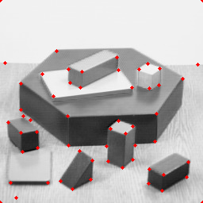
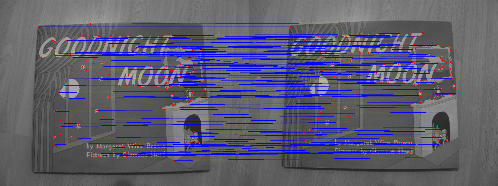
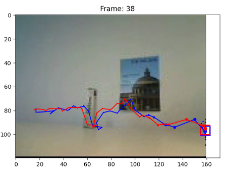
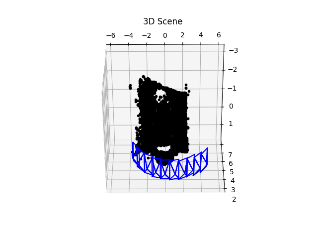
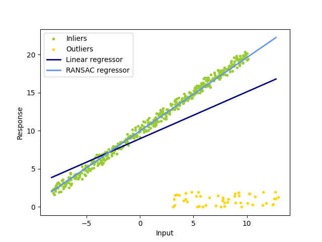

# ETH-Computer-Vision-Course-FS2023

This repo contains all my code and reports to the six mini-projects of the FS2023 Computer Vision Course at ETH. FYI, I obtained full marks on all these projects.

----

## Assignment 1 

This assignment is about implementing the Harris Corner Detector and Feature Description & Matching algorithm.

---

## Assignment 2

This assignment is to implment a MLP to first classify the toy 2D point cloud and then scale to MNIST dataset.

---

## Assignment 3

This assignment consists of two parts: 
- A bag-of-words image classifier that decides whether a test image contains a car (back view) or not. 
- A CNN-based image classification network on CIFAR-10 dataset for multi-class image classification.

---

## Assginment 4

There are two subtasks in this assignment. First, we need to implment a mean-shift algorithm for image segmentation. Second, we need to complete an implmentation for a simplified version of SegNet.

---

## Assignment 5

This assignment is about implementing the Condensation Tracker.

---

## Assignment 6

This mini-project is composed of two parts: 
- implement the Structure from Motion algorithm to produce a reconstruction of a small scene.
- implement the RANSAC (RANdom SAmple Consensus) algorithm for robust model fitting.

